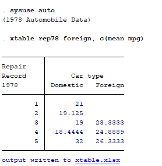
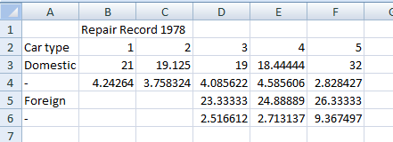

# xtable: a Stata module to export -table- output to Excel

*Important: This is still an experimental program. See [Limitations](#limitations) .*

`xtable` exports output from Stata's built-in command `table` to an Excel spreadsheet. `table` is a very powerful and flexible command, but there's still no easy solution to get its nice tables out of Stata for further processing. You have to resort to copy/paste or, at best, [`logout`](http://fmwww.bc.edu/RePEc/bocode/l/logout.html). The `putexcel` command  [introduced](https://blog.stata.com/2013/09/25/export-tables-to-excel/) in Stata 13 made exporting stuff to Excel a lot easier, but it relies on stored results and `table` produces none. 

`xtable` leverages `table`'s `replace` option to create a matrix that reproduces as best as possible what's shown on screen and then exports it using `putexcel`. Because it depends on `putexcel`, `xtable` requires Stata 13 or newer.

## Instalation 

Install it by typing:
```stata
net install xtable, from ("https://raw.githubusercontent.com/weverthonmachado/xtable/master")
```

## Usage

You can use the exact same syntax from `table`
(see [limitations](#limitations)), because `xtable` will pass the arguments to `table` (adding the `replace` option) and export the results after this. So, instead of running:

```stata
sysuse auto
table rep78 foreign, c(mean mpg)
```

you can just append an "x" and run:

```stata
sysuse auto
xtable rep78 foreign, c(mean mpg)
```

Your data will be preserved, so the only difference you will see is a link to the Excel spreadsheet containing the exported table:



And the spreadsheet will look like this:



(Commas appear as decimal separators because I use Excel in pt-BR)

## Limitations

This is an experimental program that I put together to export the kinds of table that I needed for a particular task. So, although I do plan to improve and generalize it soon, it still has a lot of ad hoc solutions and may not work for some tabulations. Specifically:

- It does not support supercolumn or any kind of totals or, surprisingly, simple one-way tables. So you can only use with `row X col` or `row X col X superrow`;
- You can't use it with `by` (i.e. `by varname: xtable`). All the other options used with `table`, such as `if`, `in`, and `weights` are ok;
- If the program breaks or throws an error, you might lose the data that was in memory, depending on where the error occurred. I can fix it quite easily with a `preserve`, but I have to change some things in the code first. By now, it's better to save the data before running `xtable`

## Author

**Weverthon Machado**  
PhD Candidate in Sociology  
[Universidade do Estado do Rio de Janeiro](https://www.iesp.uerj.br/)  

[weverthonmachado.github.io](https://weverthonmachado.github.io)
